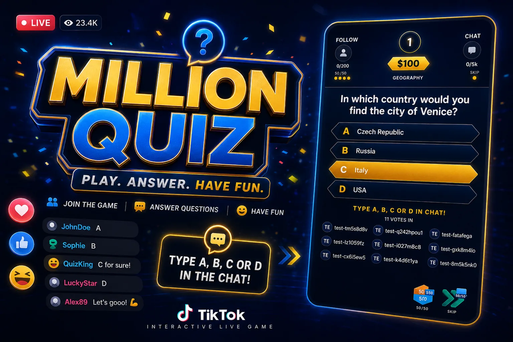
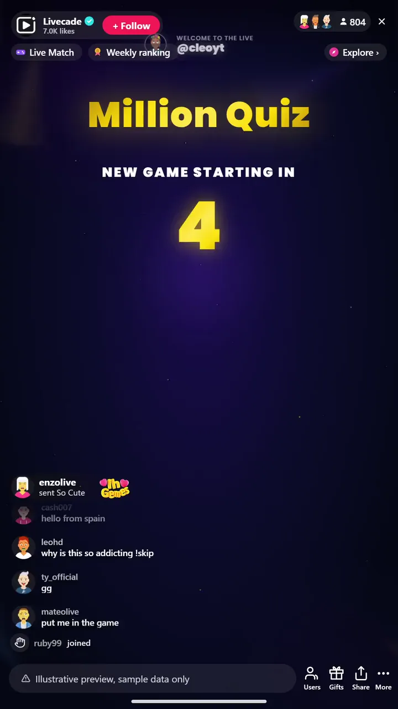

# Million Quiz - Interactive TikTok Live Game

> Your whole chat plays one trivia climb to the million.

Your audience plays a live trivia climb together. Viewers vote A, B, C or D in chat, and the crowd answer decides whether you climb the prize ladder toward the million.

**[Play Million Quiz on Livecade](https://livecade.io/games/million-quiz/?utm_source=github&utm_medium=readme&utm_campaign=million-quiz)** - runs as a single browser source in OBS, Streamlabs, or TikTok LIVE Studio. Nothing for viewers to install.

## How viewers play

Viewers take part with the actions TikTok already gives them: **comments**, **gifts**, **likes**, **follows**. Every action below is rebindable, so you decide which interaction drives which effect.

| Action | What it does |
| --- | --- |
| **50/50 lifeline** | Removes two wrong answers from the current question |
| **Skip lifeline** | Skips the current question and moves the climb along |

## How it works

### The crowd votes each answer

Every question, viewers type A, B, C or D in chat. The crowd vote locks in the answer, so the whole audience plays as one contestant.

### Climb the prize ladder

Right answers move you up a 15-level ladder with safety nets along the way. Wrong answers cost you, so every vote carries weight.

### Lifelines and goals build hype

Viewers can burn a 50/50 or a Skip, and follower and chat goals between questions keep the room loud while the next question loads.

## About the game

Million Quiz turns your whole chat into one contestant. Each question, viewers type A, B, C or D and the crowd vote locks in the answer. Climb the 15-level prize ladder, with safety nets along the way, all the way to the million.

### Gifts buy the lifelines

A gift triggers 50/50 or Skip, follower and chat goals build hype between questions, and live voter streaks keep regulars coming back.

### Thousands of questions, 29 categories

Over 8,000 English questions, 7,000 Romanian and 2,800 Turkish, across 29 trivia categories, with category selection so you can tune every show.

## What it looks like on stream

[Watch Million Quiz gameplay](https://cdn.livecade.io/games/million-quiz.mp4)

## What you can configure

- **Interface language** - English, Romanian, or Turkish for the on-screen chrome
- **Question categories** - Pick which topics the question bank pulls from
- **Prize ladder unit** - Show the ladder in dollars, Lei, coins, or points
- **Voting time** - How long the crowd has to lock in each answer
- **Follower and comment goals** - Live targets between questions to drive follows and chat
- **Header hint ticker** - A scrolling hint bar at the top of the overlay
- **Lifeline uses per game** - How many 50/50 and Skip uses each game allows
- **Read questions aloud** - Text-to-speech for questions, with scope and a Pro voice option

## Languages

English, Romanian, Turkish

## FAQ

<strong>How do viewers answer questions in Million Quiz?</strong>

Viewers type A, B, C or D in your TikTok Live chat. The crowd vote is tallied live and the majority answer locks in, so the whole audience plays together as one contestant.

<strong>How do the 50/50 and Skip lifelines work?</strong>

They are viewer-triggered actions. By default viewers spend them with a chat command, but like every trigger they are fully rebindable to a gift, like, or follow, so you decide what activates a lifeline.

<strong>Can I choose the question topics?</strong>

Yes. You pick which categories the question bank draws from, so you can run a general show or theme a session around specific topics.

<strong>How do I add Million Quiz to my TikTok Live?</strong>

Add one browser source URL to OBS or your streaming software and go live. There is no plugin to install and nothing for your viewers to download.

## Setup

1. [Create a Livecade account](https://app.livecade.io/register?utm_source=github&utm_medium=cta&utm_campaign=million-quiz)
2. Copy your overlay browser source URL
3. Paste it into OBS, Streamlabs, or TikTok LIVE Studio
4. Pick Million Quiz, set your triggers, and go live

Runs in the browser, so it works on Windows and macOS with nothing to download. [See all TikTok Live games](https://livecade.io/tiktok-live-games/?utm_source=github&utm_medium=readme&utm_campaign=million-quiz).

---

_This repository documents Million Quiz, a hosted interactive game by [Livecade](https://livecade.io/?utm_source=github&utm_medium=footer&utm_campaign=million-quiz). The game runs on Livecade's platform, so there is no source to install here._
